# Google Ads Search Campaigns Mega Plan - novamaxhospital.com

A comprehensive, ready-to-implement strategy for launching high-converting Google Search Ads for **Nova Max Hospital** in Patna. Designed to maximize patient inquiries, optimize Cost-Per-Click (CPC), and maintain strict compliance with Google's healthcare advertising policies.

---

## 🗺️ Phase 1: Target Audience & Geo-Targeting Strategy

### 1. Location Settings (Patna Focus)
Medical services are hyper-local. We want to avoid wasting budget on clicks outside the hospital's geographic service area.
*   **Primary Geo-Targeting**: Radius of **15–20 km around Digha, Patna** (includes key areas like Bailey Road, Danapur, Kankarbagh, Patliputra, Boring Road).
*   **Secondary Target (State-wide)**: Target all of **Bihar** specifically for **High-Value Surgical Procedures** (e.g., *RIRS Laser Stone Surgery, Laparoscopic Hysterectomy, Male Infertility*). Patients from rural districts frequently travel to Patna for advanced surgical consults.
*   **Targeting Option**: Set to *"Presence: People in or regularly in your targeted locations"* (Do NOT use "Presence or Interest" as it will show ads to people outside Patna searching for Patna hospitals).

### 2. Demographics & Exclusions
*   **Age Groups**: 25–34, 35–44, 45–54, 55–64, 65+ (Exclude ages 18–24 unless bidding on basic health diagnostics, as they have lower healthcare purchase authority).
*   **Household Income Target**: Top 10%, 11–20%, 21–50% (Focus budget on these segments for premium treatments like Laser Stone Surgery or AC rooms).

---

## 🏗️ Phase 2: Campaign Architecture (Overview)

To achieve maximum Quality Scores, we divide the ad budget into 6 distinct search campaigns:

```mermaid
graph TD
    A[novamaxhospital.com Google Ads] --> B["Campaign 1: Urology & Stones"]
    A --> C["Campaign 2: Laparoscopic & GI Surgery"]
    A --> D["Campaign 3: Male Infertility & Sexual Health"]
    A --> E["Campaign 4: Brand Protection"]
    A --> F["Campaign 5: Uro-Gynecology & Women's Health"]
    A --> G["Campaign 6: General Surgery"]
    
    B --> B1["Ad Group 1.1: Kidney Stones (PCNL/URS/RIRS)"]
    B --> B2["Ad Group 1.2: Prostate Surgery (TURP)"]
    B --> B3["Ad Group 1.3: UTI, Bladder & Hydrocele"]
    
    C --> C1["Ad Group 2.1: Gallbladder (Cholecystectomy)"]
    C --> C2["Ad Group 2.2: Hernia Repair (Open/Lapa)"]
    C --> C3["Ad Group 2.3: Piles & Fistula (Laser)"]
    
    D --> D1["Ad Group 3.1: Male Infertility & Varicocele"]
    D --> D2["Ad Group 3.2: Erectile Dysfunction (ED)"]
    D --> D3["Ad Group 3.3: Premature Ejaculation (PE)"]
    
    E --> E1["Ad Group 4.1: Brand Name (Nova Max)"]
    E --> E2["Ad Group 4.2: Brand Doctor (Dr. Sinha)"]
    E --> E3["Ad Group 4.3: Location & Booking Info"]
    
    F --> F1["Ad Group 5.1: Urinary Incontinence & Prolapse"]
    F --> F2["Ad Group 5.2: Gynecologist Consult"]
    F --> F3["Ad Group 5.3: D&C Procedure"]
    
    G --> G1["Ad Group 6.1: General Surgeon Queries"]
    G --> G2["Ad Group 6.2: Appendix Surgery (Lapa/Open)"]
    G --> G3["Ad Group 6.3: AV Fistula Creation"]
    G --> G4["Ad Group 6.4: Thyroidectomy Surgery"]
```



---

## 📂 Phase 3: Deep-Dive Campaign Implementation

This section groups each Campaign's landing pages, targeted keywords, and corresponding Responsive Search Ad (RSA) copywriting templates together for direct, streamlined setup.

---

### 🫘 Campaign 1: Urology & Kidney Stone Care (High Intent)
*   **Target Landing Page**: [Urology Department](file:///e:/CGP360_PROJECTS/NOVA%20MAX%20HOSPITAL/NOVA%20MAX%20HOSPITAL/src/pages/ServiceDetail.jsx) (`https://novamaxhospital.com/services/urology`)
*   **Demographic Focus**: Adults aged 25–65+ (skews heavily male for Prostate/Calculi, but includes both genders for kidney stones).
*   **Custom Intent Segments**: Users searching for: *"flank pain"*, *"blood in urine"*, *"burning urination urologist"*, *"kidney stone laser surgery cost"*, *"best kidney stone hospital in Patna"*.
*   **Campaign USPs**: Led by Dr. M.K. Sinha (Senior Urologist, ex-Sir J.J. Hospital Mumbai), 100% blade-free Laser RIRS surgery, modular OT, same-day discharge.
*   **Campaign-Level Sitelink Assets (Configure 4)**:
    1.  **Sitelink 1: Kidney Stone Page** (URL: `https://novamaxhospital.com/services/urology/treatment/kidney-stone-treatment`)
        *   *Description Line 1*: Laser Stone Surgery Patna
        *   *Description Line 2*: 100% Blade-free RIRS Lithotripsy
    2.  **Sitelink 2: Prostate Surgery** (URL: `https://novamaxhospital.com/services/urology/treatment/prostate-surgery`)
        *   *Description Line 1*: Laser TURP Surgery Patna
        *   *Description Line 2*: Relieve Urinary Blockage & BPH
    3.  **Sitelink 3: Dr. M.K. Sinha Profile** (URL: `https://novamaxhospital.com/doctors/dr-m-k-sinha`)
        *   *Description Line 1*: Senior Urologist & Surgeon
        *   *Description Line 2*: Ex-Sir J.J. Hospital Mumbai
    4.  **Sitelink 4: Book Appointment** (URL: `https://novamaxhospital.com/book-appointment`)
        *   *Description Line 1*: Secure Direct OPD Slot
        *   *Description Line 2*: Quick Direct Hospital Booking

#### Ad Group 1.1: Kidney Stone Treatment (PCNL/URS/RIRS)
*   **Final Destination Sub-URL**: [Kidney Stone Page](file:///e:/CGP360_PROJECTS/NOVA%20MAX%20HOSPITAL/NOVA%20MAX%20HOSPITAL/src/pages/TreatmentDetail.jsx) (`/services/urology/treatment/kidney-stone-treatment`)
*   **Phrase Match Keywords**:
    ```text
    "kidney stone doctor in patna"
    "laser stone surgery cost patna"
    "best hospital for kidney stone patna"
    "rirs surgery in patna"
    "laser lithotripsy surgery patna"
    "kidney stone laser treatment digha"
    ```
*   **Exact Match Keywords**:
    ```text
    [kidney stone treatment patna]
    [best urologist in patna]
    [rirs stone surgery cost patna]
    [kidney stone laser treatment cost]
    ```
*   **Responsive Search Ad Template (Template 1A)**:
    *   *Headlines (Max 30 chars)*:
        1. `Kidney Stone Treatment Patna` *(Pin to Position 1)*
        2. `Expert Urologist Dr. M.K.Sinha`
        3. `Laser Stone Surgery Patna`
        4. `100% Blade-Free RIRS Surgery`
        5. `Minimally Invasive PCNL/URS`
        6. `Book Consultation Today`
        8. `Advanced Urology Hospital`
        9. `Urgent Flank Pain Care`
        10. `Daycare Discharge In 24 Hrs`
    *   *Descriptions (Max 90 chars)*:
        1. `Get advanced laser lithotripsy & RIRS for kidney stones. Minimally invasive daycare care.`
        2. `Led by Senior Urologist Dr. M. K. Sinha (ex-Mumbai). Standard diagnosis & post-op ICU support.`
        3. `Struggling with kidney stone pain? Safe, fast recovery daycare treatments. Call us today.`
        4. `Complete kidney stone extraction using Holmium Laser scope. Book appointment now.`

#### Ad Group 1.2: Prostate Surgery (TURP)
*   **Final Destination Sub-URL**: [Prostate Surgery Page](file:///e:/CGP360_PROJECTS/NOVA%20MAX%20HOSPITAL/NOVA%20MAX%20HOSPITAL/src/pages/TreatmentDetail.jsx) (`/services/urology/treatment/prostate-surgery`)
*   **Phrase Match Keywords**:
    ```text
    "prostate doctor in patna"
    "turp prostate surgery cost patna"
    "best prostate surgeon patna"
    "laser prostatectomy patna"
    "bph treatment clinic patna"
    ```
*   **Exact Match Keywords**:
    ```text
    [prostate doctor patna]
    [turp surgery cost in patna]
    ```
*   **Responsive Search Ad Template (Template 1B)**:
    *   *Headlines (Max 30 chars)*:
        1. `Prostate Doctor in Patna` *(Pin to Position 1)*
        2. `Expert Urologist Dr. M.K.Sinha`
        3. `Laser Prostate Surgery TURP`
        4. `BPH Prostate Treatment`
        5. `Endoscopic TURP Surgery`
        6. `Book Consultation Today`
        7. `Opp. Women's ITI, Digha`
        8. `Advanced Urology Hospital`
        9. `Relieve Urinary Blockage`
        10. `Daycare Discharge In 24 Hrs`
    *   *Descriptions (Max 90 chars)*:
        1. `Get advanced laser TURP & BPH prostate treatment. Led by Chief Urologist Dr. M. K. Sinha.`
        2. `Suffering from prostate issues, frequency, or urinary blockage? Book an appointment today.`
        3. `Safe endoscopic prostate surgery with minimal recovery time. Call Nova Max Hospital.`
        4. `Restore comfortable bladder function with expert TURP surgery. Consult Dr. M.K. Sinha.`

#### Ad Group 1.3: UTI, Bladder & Hydrocele Care
*   **Final Destination Sub-URL**: [Urology Department](file:///e:/CGP360_PROJECTS/NOVA%20MAX%20HOSPITAL/NOVA%20MAX%20HOSPITAL/src/pages/ServiceDetail.jsx) (`/services/urology`)
*   **Phrase Match Keywords**:
    ```text
    "uti treatment in patna"
    "bladder pain doctor patna"
    "hydrocele surgery cost patna"
    "circumcision doctor in patna"
    "bladder stone laser surgery patna"
    ```
*   **Exact Match Keywords**:
    ```text
    [uti doctor patna]
    [hydrocele surgery patna]
    [circumcision surgery patna]
    ```
*   **Responsive Search Ad Template (Template 1C)**:
    *   *Headlines (Max 30 chars)*:
        1. `UTI & Bladder Treatment Patna` *(Pin to Position 1)*
        2. `Hydrocele & Circumcision Care`
        3. `Expert Urologist Dr. M.K.Sinha`
        4. `Painless Laser Circumcision`
        5. `Bladder Stone Litholapaxy`
        6. `Book Urology Appointment`
        7. `Opp. Women's ITI, Digha`
        8. `Safe Daycare Surgical Exit`
    *   *Descriptions (Max 90 chars)*:
        1. `Get comprehensive care for painful UTIs, bladder stone removal, and daycare hydrocele surgery.`
        2. `Led by Senior Urologist Dr. M.K. Sinha. Standard diagnostic testing & sterile OT care.`
        3. `Sutureless laser circumcision and minimal access hydrocelectomy. Quick discharge & low pain.`

---

### 🔬 Campaign 2: Laparoscopic & GI Surgery (High Value)
*   **Target Landing Page**: [Laparoscopy Department](file:///e:/CGP360_PROJECTS/NOVA%20MAX%20HOSPITAL/NOVA%20MAX%20HOSPITAL/src/pages/ServiceDetail.jsx) (`https://novamaxhospital.com/services/laparoscopy`)
*   **Demographic Focus**: Adults aged 25–65+ (gender-neutral; family decision-makers).
*   **Custom Intent Segments**: Users searching for: *"gallbladder stone removal cost"*, *"laparoscopic hernia surgery Patna"*, *"appendix surgery cost Digha"*, *"piles laser treatment clinic"*.
*   **Campaign USPs**: Minimal incisions (keyhole surgery), minimal post-op pain, rapid return to work (24–48hr discharge), modular operation theatre, senior urologist and laparoscopic surgeon Dr. M.K. Sinha (30+ years experience).
*   **Campaign-Level Sitelink Assets (Configure 4)**:
    1.  **Sitelink 1: Gallbladder Surgery** (URL: `https://novamaxhospital.com/services/laparoscopy/treatment/laparoscopic-cholecystectomy`)
        *   *Description Line 1*: Keyhole Gallstone Removal
        *   *Description Line 2*: 24-Hour Daycare Discharge
    2.  **Sitelink 2: Hernia Mesh Repair** (URL: `https://novamaxhospital.com/services/laparoscopy/treatment/laparoscopic-hernia-repair`)
        *   *Description Line 1*: Laparoscopic TEP/TAPP Mesh
        *   *Description Line 2*: Sutureless Wall Reinforcement
    3.  **Sitelink 3: Dr. M.K. Sinha Profile** (URL: `https://novamaxhospital.com/doctors/dr-m-k-sinha`)
        *   *Description Line 1*: Senior Laparoscopic Surgeon
        *   *Description Line 2*: 30+ Years Operating Experience
    4.  **Sitelink 4: Book Appointment** (URL: `https://novamaxhospital.com/book-appointment`)
        *   *Description Line 1*: Direct Surgeon Consultation
        *   *Description Line 2*: Easy pre-operative slots

#### Ad Group 2.1: Gallbladder Stone Removal (Cholecystectomy)
*   **Final Destination Sub-URL**: [Gallbladder Page](file:///e:/CGP360_PROJECTS/NOVA%20MAX%20HOSPITAL/NOVA%20MAX%20HOSPITAL/src/pages/TreatmentDetail.jsx) (`/services/laparoscopy/treatment/laparoscopic-cholecystectomy`)
*   **Phrase Match Keywords**:
    ```text
    "gallbladder stone surgery cost patna"
    "laparoscopic gallbladder removal patna"
    "best gall stone surgeon patna"
    "gallstone keyhole surgery patna"
    ```
*   **Exact Match Keywords**:
    ```text
    [gallbladder surgery cost in patna]
    [laparoscopic cholecystectomy patna]
    [laparoscopic cholecystectomy patna]
    ```
*   **Responsive Search Ad Template (Template 2A)**:
    *   *Headlines*:
        1. `Gallstone Surgery Patna` *(Pin to Position 1)*
        2. `Laparoscopic Cholecystectomy`
        3. `Expert Surgeon Dr. M.K.Sinha`
        4. `Gallbladder Removal Cost`
        5. `Modular Operation Theatre`
        6. `Book Surgery Consultation`
        7. `Same-Day Discharge Available`
        8. `Advanced Keyhole Surgery`
        9. `Best Gall Stone Surgeon`
        10. `Opp. Women's ITI, Digha`
    *   *Descriptions*:
        1. `Advanced laparoscopic keyhole gallbladder removal. Safe daycare surgery in Patna.`
        2. `Led by Chief Surgeon Dr. M.K. Sinha. Deluxe AC private rooms & emergency ICU backup.`
        3. `Suffering from gallstone pain? Safe keyhole cholecystectomy procedures. Call us today.`
        4. `Complete gallbladder stone extraction using high-definition camera scope. Book now.`

#### Ad Group 2.2: Laparoscopic Hernia Repair (TEP/TAPP)
*   **Final Destination Sub-URL**: [Hernia Page](file:///e:/CGP360_PROJECTS/NOVA%20MAX%20HOSPITAL/NOVA%20MAX%20HOSPITAL/src/pages/TreatmentDetail.jsx) (`/services/laparoscopy/treatment/laparoscopic-hernia-repair`)
*   **Phrase Match Keywords**:
    ```text
    "hernia surgery cost patna"
    "best hernia doctor in patna"
    "laparoscopic hernia repair patna"
    "inguinal hernia surgery patna"
    ```
*   **Exact Match Keywords**:
    ```text
    [hernia surgery cost patna]
    [mesh hernia repair patna]
    ```
*   **Responsive Search Ad Template (Template 2B)**:
    *   *Headlines*:
        1. `Laparoscopic Hernia Repair` *(Pin to Position 1)*
        2. `Hernia Surgery Cost Patna`
        3. `Expert Surgeon Dr. M.K.Sinha`
        4. `Sutureless Mesh Hernia Repair`
        5. `TEP & TAPP Hernia Repairs`
        6. `Book Surgery Consultation`
        7. `Same-Day Discharge Available`
        8. `Best Hernia Doctor in Patna`
        9. `Advanced Modular OT & ICU`
        10. `Opp. Women's ITI, Digha`
    *   *Descriptions*:
        1. `Advanced laparoscopic hernia repair with high-quality mesh reinforcement. Low pain.`
        2. `Led by Chief Surgeon Dr. M.K. Sinha. Minimal incisions and rapid return to work.`
        3. `Get permanent mesh repair for inguinal or umbilical hernias. Call Nova Max Hospital.`
        4. `Top-rated keyhole hernia repair surgeries. Quick recovery daycare procedures.`

#### Ad Group 2.3: Piles, Fissure & Fistula (Laser Procedures)
*   **Final Destination Sub-URL**: [Piles Page](file:///e:/CGP360_PROJECTS/NOVA%20MAX%20HOSPITAL/NOVA%20MAX%20HOSPITAL/src/pages/TreatmentDetail.jsx) (`/services/general-surgery/treatment/piles-laser-stapled-surgery`)
*   **Phrase Match Keywords**:
    ```text
    "piles laser surgery cost patna"
    "best piles doctor in patna"
    "fistula surgery cost in patna"
    "laser piles clinic patna"
    "anal fissure laser treatment patna"
    ```
*   **Exact Match Keywords**:
    ```text
    [piles laser surgery cost patna]
    [best fistula doctor patna]
    ```
*   **Responsive Search Ad Template (Template 2C)**:
    *   *Headlines*:
        1. `Laser Piles Surgery Patna` *(Pin to Position 1)*
        2. `Painless Fistula Treatment`
        3. `Best General Surgeons in Patna`
        4. `Sutureless Daycare Procedures`
        5. `Quick Recovery & Same-Day Exit`
        6. `Confidential Consultations`
        7. `Advanced Laser Hemorrhoids`
        8. `No Pain, No Suture Daycare`
    *   *Descriptions*:
        1. `Advanced painless laser ablation for piles, fissure & fistula. Get back home in 24 hours.`
        2. `Sutureless piles surgery under senior consultants. Transparent pricing & ICU recovery.`
        3. `Say goodbye to painful piles. Sutureless daycare laser treatments. Walk-in clinic Patna.`

---

### 👨 Campaign 3: Male Infertility & Sexual Health (Confidential)
*   **Target Landing Page**: [Male Infertility](file:///e:/CGP360_PROJECTS/NOVA%20MAX%20HOSPITAL/NOVA%20MAX%20HOSPITAL/src/pages/ServiceDetail.jsx) (`https://novamaxhospital.com/services/male-infertility`) or [Sexology](file:///e:/CGP360_PROJECTS/NOVA%20MAX%20HOSPITAL/NOVA%20MAX%20HOSPITAL/src/pages/ServiceDetail.jsx) (`/services/sexology`)
*   **Demographic Focus**: Males aged 22–50.
*   **Custom Intent Segments**: Users searching for: *"semen analysis clinic Patna"*, *"varicocele doctor Patna"*, *"sexologist near me"*, *"erectile dysfunction cure doctor"*.
*   **Campaign USPs**: 100% confidential consultations, private counseling chambers, in-house pathology lab for quick semen analysis, expert micro-surgical varicocelectomy.
*   **Campaign-Level Sitelink Assets (Configure 4)**:
    1.  **Sitelink 1: Varicocele Repair** (URL: `https://novamaxhospital.com/services/male-infertility/treatment/varicocele-treatment`)
        *   *Description Line 1*: Microscopic Varicocelectomy
        *   *Description Line 2*: Upgrades Testicular Health
    2.  **Sitelink 2: Sexual Health Care** (URL: `https://novamaxhospital.com/services/sexology`)
        *   *Description Line 1*: Confident ED/PE Treatments
        *   *Description Line 2*: Safe, Private Consultation
    3.  **Sitelink 3: Dr. M.K. Sinha Profile** (URL: `https://novamaxhospital.com/doctors/dr-m-k-sinha`)
        *   *Description Line 1*: Chief Urologist & Specialist
        *   *Description Line 2*: ex-Sir J.J. Hospital Mumbai
    4.  **Sitelink 4: Book Appointment** (URL: `https://novamaxhospital.com/book-appointment`)
        *   *Description Line 1*: Secure Private Consult Slot
        *   *Description Line 2*: 100% Discrete & Confidential

#### Ad Group 3.1: Male Infertility & Varicocele
*   **Final Destination Sub-URL**: [Varicocele Page](file:///e:/CGP360_PROJECTS/NOVA%20MAX%20HOSPITAL/NOVA%20MAX%20HOSPITAL/src/pages/TreatmentDetail.jsx) (`/services/male-infertility/treatment/varicocele-treatment`)
*   **Phrase Match Keywords**:
    ```text
    "male infertility doctor patna"
    "varicocelectomy surgery cost patna"
    "best semen analysis lab patna"
    "varicocele surgeon in patna"
    ```
*   **Exact Match Keywords**:
    ```text
    [male infertility doctor patna]
    [varicocele surgery cost patna]
    ```
*   **Responsive Search Ad Template (Template 3A)**:
    *   *Headlines*:
        1. `Male Infertility Doctor Patna` *(Pin to Position 1)*
        2. `Varicocele Micro-Surgery Cost`
        3. `Semen Analysis Lab In-House`
        4. `Expert Urologist Dr. M.K.Sinha`
        5. `100% Confidential Consults`
        6. `Varicocelectomy Surgeon Patna`
        7. `Advanced Fertility Diagnostics`
        8. `Book Private Appointment`
    *   *Descriptions*:
        1. `100% private & confidential male infertility consultations. Semen analysis in-house.`
        2. `Expert varicocele micro-surgery (microscopic varicocelectomy) by Dr. M.K. Sinha.`
        3. `Get accurate diagnostics & evidence-based medical treatments. Call Nova Max Hospital.`

#### Ad Group 3.2: Erectile Dysfunction (ED) Care
*   **Final Destination Sub-URL**: [Erectile Dysfunction Page](file:///e:/CGP360_PROJECTS/NOVA%20MAX%20HOSPITAL/NOVA%20MAX%20HOSPITAL/src/pages/TreatmentDetail.jsx) (`/services/sexology/treatment/erectile-dysfunction`)
*   **Phrase Match Keywords**:
    ```text
    "erectile dysfunction doctor patna"
    "ed treatment clinic patna"
    "best doctor for ed in patna"
    "impotence doctor near me"
    ```
*   **Exact Match Keywords**:
    ```text
    [erectile dysfunction doctor patna]
    [best doctor for ed in patna]
    ```
*   **Responsive Search Ad Template (Template 3B)**:
    *   *Headlines*:
        1. `Erectile Dysfunction Doctor` *(Pin to Position 1)*
        2. `ED Treatment Clinic Patna`
        3. `Restoring Physical Confidence`
        4. `Dr. M.K. Sinha Sexologist`
        5. `100% Confidential ED Cure`
        6. `Safe Vascular Health Plans`
        7. `Private Counsel Chambers`
        8. `Book Private Direct Slot`
    *   *Descriptions*:
        1. `Get safe, clinically proven medical therapy for erectile dysfunction. 100% discrete.`
        2. `Led by Chief Urologist & Sexologist Dr. M.K. Sinha. Comprehensive hormonal & vascular checks.`
        3. `Overcome ED with personalized, evidence-based medical care. Direct appointments available.`

#### Ad Group 3.3: Premature Ejaculation (PE) & Sexology
*   **Final Destination Sub-URL**: [Premature Ejaculation Page](file:///e:/CGP360_PROJECTS/NOVA%20MAX%20HOSPITAL/NOVA%20MAX%20HOSPITAL/src/pages/TreatmentDetail.jsx) (`/services/sexology/treatment/premature-ejaculation`)
*   **Phrase Match Keywords**:
    ```text
    "best sexologist doctor in patna"
    "premature ejaculation treatment patna"
    "sexologist near digha patna"
    "performance anxiety doctor patna"
    ```
*   **Exact Match Keywords**:
    ```text
    [best sexologist in patna]
    [premature ejaculation treatment patna]
    ```
*   **Responsive Search Ad Template (Template 3C)**:
    *   *Headlines*:
        1. `Best Sexologist Doctor Patna` *(Pin to Position 1)*
        2. `Premature Ejaculation Treatment`
        3. `Improve Stamina & Performance`
        4. `Performance Anxiety Relief`
        5. `100% Confidential Consults`
        6. `Private counseling chambers`
        7. `Opp. Women's ITI, Digha`
        8. `Book Direct Appointment`
    *   *Descriptions*:
        1. `100% private & confidential sexology counseling & PE treatments. Call us today.`
        2. `Clinically proven medical therapy to improve stamina & timing. Consult Dr. M.K. Sinha.`
        3. `Rebuild performance confidence in a safe, supportive environment. Call Nova Max.`

---

### 🏥 Campaign 4: Brand Protection (Direct Action)
*   **Target Landing Page**: [Homepage](file:///e:/CGP360_PROJECTS/NOVA%20MAX%20HOSPITAL/NOVA%20MAX%20HOSPITAL/src/pages/Home.jsx) (`https://novamaxhospital.com`)
*   **Demographic Focus**: All demographics in Patna.
*   **Campaign USPs**: Direct official appointment booking channel, contact details, coordinates, modular operation theatre and emergency ICU.
*   **Campaign-Level Sitelink Assets (Configure 4)**:
    1.  **Sitelink 1: Dr. M.K. Sinha Profile** (URL: `https://novamaxhospital.com/doctors/dr-m-k-sinha`)
        *   *Description Line 1*: Chief Urologist & Surgeon
        *   *Description Line 2*: ex-Sir J.J. Hospital Mumbai
    2.  **Sitelink 2: Urology Department** (URL: `https://novamaxhospital.com/services/urology`)
        *   *Description Line 1*: Advanced Urology Care
        *   *Description Line 2*: Complete Bladder & Stone Clinic
    3.  **Sitelink 3: Laparoscopy Clinic** (URL: `https://novamaxhospital.com/services/laparoscopy`)
        *   *Description Line 1*: Advanced Minimally Invasive
        *   *Description Line 2*: Gallbladder, Hernia, Appendix
    4.  **Sitelink 4: ICU & Emergencies** (URL: `https://novamaxhospital.com/critical-care`)
        *   *Description Line 1*: 24/7 Critical Emergency
        *   *Description Line 2*: ICU Ventilator support

#### Ad Group 4.1: Brand Name Queries
*   **Final Destination Sub-URL**: [Homepage](file:///e:/CGP360_PROJECTS/NOVA%20MAX%20HOSPITAL/NOVA%20MAX%20HOSPITAL/src/pages/Home.jsx) (`/`)
*   **Keywords**:
    ```text
    "nova max hospital"
    "novamax hospital patna"
    "nova max hospital digha"
    "novamax hospital website"
    ```
*   **Responsive Search Ad Template (Template 4A)**:
    *   *Headlines*:
        1. `Nova Max Hospital - Patna` *(Pin to Position 1)*
        2. `Official Website - Book Direct`
        3. `Urology & Laparoscopy Center`
        4. `General Surgery Specialist`
        5. `Opposite Women's ITI Digha`
    *   *Descriptions*:
        1. `Welcome to Nova Max Hospital. Official booking channel for direct doctor appointments.`
        2. `Advanced urological surgeries, laparoscopic treatments, ICU and pathology diagnostics.`

#### Ad Group 4.2: Brand Doctor Queries
*   **Final Destination Sub-URL**: [Dr. M.K. Sinha Profile](file:///e:/CGP360_PROJECTS/NOVA%20MAX%20HOSPITAL/NOVA%20MAX%20HOSPITAL/src/pages/DoctorDetail.jsx) (`/doctors/dr-m-k-sinha`)
*   **Keywords**:
    ```text
    "dr m k sinha urologist"
    "dr m k sinha patna"
    "dr m k sinha nova max"
    "dr m k sinha surgeon"
    ```
*   **Responsive Search Ad Template (Template 4B)**:
    *   *Headlines*:
        1. `Dr. M.K. Sinha - Urologist` *(Pin to Position 1)*
        2. `Chief Surgeon Nova Max Patna`
        3. `30+ Years Expert Experience`
        4. `Ex-Sir J.J. Hospital Mumbai`
        5. `Book Consultation Today`
    *   *Descriptions*:
        1. `Consult Dr. M.K. Sinha, Director of Nova Max Hospital Patna. Over 30 years experience.`
        2. `Expert in laser kidney stone treatment, prostate surgery, laparoscopy & general surgery.`

#### Ad Group 4.3: Brand Location, Contact & Booking Queries
*   **Final Destination Sub-URL**: [Book Appointment](file:///e:/CGP360_PROJECTS/NOVA%20MAX%20HOSPITAL/NOVA%20MAX%20HOSPITAL/src/pages/BookAppointment.jsx) (`/book-appointment`)
*   **Keywords**:
    ```text
    "nova max hospital phone number"
    "nova max hospital address"
    "book appointment nova max hospital"
    "nova max hospital contact"
    ```
*   **Responsive Search Ad Template (Template 4C)**:
    *   *Headlines*:
        1. `Nova Max Hospital Contact` *(Pin to Position 1)*
        2. `Book OPD Appointment Direct`
        3. `Address: Digha Patna`
        4. `Call 24/7: +917250520694`
        5. `Opp. Women's ITI College`
    *   *Descriptions*:
        1. `Find address details, contact numbers & official booking pages for Nova Max Hospital.`
        2. `Call +917250520694 to book an OPD consultation or connect with emergency services.`

---

### 🤰 Campaign 5: Uro-Gynecology & Women's Health (Specialist Care)
*   **Target Landing Page**: [Uro Gynecology Department](file:///e:/CGP360_PROJECTS/NOVA%20MAX%20HOSPITAL/NOVA%20MAX%20HOSPITAL/src/pages/ServiceDetail.jsx) (`https://novamaxhospital.com/services/uro-gynecology`)
*   **Demographic Focus**: Females aged 22–65+.
*   **Campaign USPs**: Lady doctor consultations, personalized pelvic floor care, advanced sling surgeries (TVT/TOT) for leakage, modular sterile OT.
*   **Campaign-Level Sitelink Assets (Configure 4)**:
    1.  **Sitelink 1: Urinary Incontinence** (URL: `https://novamaxhospital.com/services/uro-gynecology/treatment/urinary-incontinence`)
        *   *Description Line 1*: TVT/TOT Sling Surgery Patna
        *   *Description Line 2*: Stop Accidental Leaking
    2.  **Sitelink 2: Pelvic Prolapse Care** (URL: `https://novamaxhospital.com/services/uro-gynecology/treatment/pelvic-organ-prolapse`)
        *   *Description Line 1*: Specialized Ligament Repair
        *   *Description Line 2*: Restore Normal Support
    3.  **Sitelink 3: Gynecologist Consult** (URL: `https://novamaxhospital.com/services/uro-gynecology/treatment/gynaecological-consultation`)
        *   *Description Line 1*: PCOS & PCOD Clinical Care
        *   *Description Line 2*: Consult Lady Doctors
    4.  **Sitelink 4: Daycare D&C Procedure** (URL: `https://novamaxhospital.com/services/uro-gynecology/treatment/dc-procedure`)
        *   *Description Line 1*: Safe Daycare Procedure
        *   *Description Line 2*: Quick Clinical Recovery

#### Ad Group 5.1: Urinary Incontinence & Pelvic Prolapse
*   **Final Destination Sub-URL**: [Incontinence Page](file:///e:/CGP360_PROJECTS/NOVA%20MAX%20HOSPITAL/NOVA%20MAX%20HOSPITAL/src/pages/TreatmentDetail.jsx) (`/services/uro-gynecology/treatment/urinary-incontinence`) or [Prolapse Page](file:///e:/CGP360_PROJECTS/NOVA%20MAX%20HOSPITAL/NOVA%20MAX%20HOSPITAL/src/pages/TreatmentDetail.jsx) (`/services/uro-gynecology/treatment/pelvic-organ-prolapse`)
*   **Phrase Match Keywords**:
    ```text
    "female urine leakage doctor patna"
    "urinary incontinence treatment patna"
    "uterus prolapse treatment patna"
    "best urogynecologist in patna"
    "pelvic organ prolapse surgery cost"
    ```
*   **Exact Match Keywords**:
    ```text
    [urine leakage treatment in patna]
    [best doctor for uterus prolapse patna]
    ```
*   **Responsive Search Ad Template (Template 5A)**:
    *   *Headlines*:
        1. `Female Urine Leakage Cure` *(Pin to Position 1)*
        2. `Expert Urogynecologist Patna`
        3. `Pelvic Organ Prolapse Care`
        4. `Advanced TVT/TOT Sling Surgery`
        5. `Experienced Lady Doctors`
        6. `Tighten Pelvic Floor Muscles`
        7. `Opp. Women's ITI, Digha`
        8. `Uterine Prolapse Surgery`
    *   *Descriptions*:
        1. `Regain confidence with advanced treatments for urinary leaks and pelvic organ prolapse.`
        2. `Get advanced mid-urethral TVT/TOT sling surgeries for stress urinary leakage.`
        3. `Dedicated care for women's pelvic organ support. Consult experienced specialists today.`

#### Ad Group 5.2: Gynecologist Consult & Lady Doctors
*   **Final Destination Sub-URL**: [Gynecologist Consultation](file:///e:/CGP360_PROJECTS/NOVA%20MAX%20HOSPITAL/NOVA%20MAX%20HOSPITAL/src/pages/TreatmentDetail.jsx) (`/services/uro-gynecology/treatment/gynaecological-consultation`)
*   **Phrase Match Keywords**:
    ```text
    "best gynecologist doctor in patna"
    "gynecology clinic digha patna"
    "female health checkup patna"
    "lady doctor gynecologist patna"
    ```
*   **Exact Match Keywords**:
    ```text
    [best gynecologist in patna]
    [lady gynecologist patna]
    ```
*   **Responsive Search Ad Template (Template 5B)**:
    *   *Headlines*:
        1. `Gynecologist Consult Patna` *(Pin to Position 1)*
        2. `PCOS & PCOD Clinical Care`
        3. `Abnormal Periods Treatment`
        4. `Experienced Lady Doctors`
        5. `Gynecology Clinic in Digha`
        6. `Abnormal Bleeding Diagnosis`
        7. `Book Private Consultation`
        8. `Opp. Women's ITI, Digha`
    *   *Descriptions*:
        1. `Consult experienced lady specialists for PCOS, irregular cycles, pelvic pain & wellness.`
        2. `Compassionate reproductive healthcare for women. Standard clinical diagnostics. Call today.`
        3. `Safe and supportive gynecology consulting at Nova Max. Direct booking available.`

#### Ad Group 5.3: D&C (Dilation & Curettage) Procedure
*   **Final Destination Sub-URL**: [D&C Page](file:///e:/CGP360_PROJECTS/NOVA%20MAX%20HOSPITAL/NOVA%20MAX%20HOSPITAL/src/pages/TreatmentDetail.jsx) (`/services/uro-gynecology/treatment/dc-procedure`)
*   **Phrase Match Keywords**:
    ```text
    "d&c procedure cost patna"
    "dilation and curettage clinic"
    "uterine biopsy doctor patna"
    "daycare d&c surgery patna"
    ```
*   **Exact Match Keywords**:
    ```text
    [d and c surgery cost patna]
    [d&c procedure cost patna]
    ```
*   **Responsive Search Ad Template (Template 5C)**:
    *   *Headlines*:
        1. `Daycare D&C Procedure Cost` *(Pin to Position 1)*
        2. `Safe Uterine Biopsy Patna`
        3. `Dilation & Curettage Clinic`
        4. `Hygienic Surgical Daycare`
        5. `Experienced Lady Surgeons`
        6. `Abnormal Bleeding Diagnosis`
        7. `Book Consultation Today`
        8. `Opp. Women's ITI, Digha`
    *   *Descriptions*:
        1. `Safe & hygienic daycare D&C and gynecological procedures. Book a private consult.`
        2. `Get transparent pricing on daycare D&C procedures under expert lady surgeons.`
        3. `Comfortable surgical daycare rooms, experienced specialists, and quick recovery cycles.`

---

### 🔪 Campaign 6: General Surgery & Special Procedures (Essential Surgical)
*   **Target Landing Page**: [General Surgery Department](file:///e:/CGP360_PROJECTS/NOVA%20MAX%20HOSPITAL/NOVA%20MAX%20HOSPITAL/src/pages/ServiceDetail.jsx) (`https://novamaxhospital.com/services/general-surgery`)
*   **Demographic Focus**: Adults aged 18–65+.
*   **Campaign USPs**: Experienced chief surgeon Dr. M.K. Sinha (30+ years experience), advanced open and laser surgical options, low infection rates, transparent daycare package pricing.
*   **Campaign-Level Sitelink Assets (Configure 4)**:
    1.  **Sitelink 1: Appendix Surgery** (URL: `https://novamaxhospital.com/services/general-surgery/treatment/appendectomy`)
        *   *Description Line 1*: Open & Laparoscopic Appendix
        *   *Description Line 2*: Urgent Appendicitis Care
    2.  **Sitelink 2: AV Fistula Creation** (URL: `https://novamaxhospital.com/services/general-surgery/treatment/av-fistula-surgery`)
        *   *Description Line 1*: Dialysis Access Procedure
        *   *Description Line 2*: High success rate slots
    3.  **Sitelink 3: Dr. M.K. Sinha Profile** (URL: `https://novamaxhospital.com/doctors/dr-m-k-sinha`)
        *   *Description Line 1*: Senior General Surgeon Patna
        *   *Description Line 2*: Ex-Sir J.J. Hospital Mumbai
    4.  **Sitelink 4: Book Appointment** (URL: `https://novamaxhospital.com/book-appointment`)
        *   *Description Line 1*: Direct Surgeon Consultation
        *   *Description Line 2*: Easy pre-operative checkups

#### Ad Group 6.1: General Surgeon Queries
*   **Final Destination Sub-URL**: [General Surgery Department](file:///e:/CGP360_PROJECTS/NOVA%20MAX%20HOSPITAL/NOVA%20MAX%20HOSPITAL/src/pages/ServiceDetail.jsx) (`/services/general-surgery`)
*   **Phrase Match Keywords**:
    ```text
    "best general surgeon in patna"
    "general surgery hospital patna"
    "surgical clinic in digha patna"
    ```
*   **Exact Match Keywords**:
    ```text
    [best general surgeon patna]
    [general surgery doctor patna]
    ```
*   **Responsive Search Ad Template (Template 6A)**:
    *   *Headlines*:
        1. `Best General Surgeon Patna` *(Pin to Position 1)*
        2. `Chief Surgeon Dr. M.K. Sinha`
        3. `Lipoma & Cyst Daycare Removal`
        4. `Abscess Drainage & Wound Care`
        5. `Deluxe AC Post-Op Rooms`
        6. `Book Surgery Consultation`
        7. `Advanced Modular OT & ICU`
        8. `Opp. Women's ITI, Digha`
    *   *Descriptions*:
        1. `Advanced minor and major surgical consults. Fast recovery daycare excisions.`
        2. `Led by chief surgeon Dr. M.K. Sinha (30+ yrs experience). Daycare surgical exit.`
        3. `Hygienic, top-rated surgery department in Patna. Transparent package pricing.`

#### Ad Group 6.2: Appendix Surgery (Laparoscopic & Open)
*   **Final Destination Sub-URL**: [Appendectomy Page](file:///e:/CGP360_PROJECTS/NOVA%20MAX%20HOSPITAL/NOVA%20MAX%20HOSPITAL/src/pages/TreatmentDetail.jsx) (`/services/general-surgery/treatment/appendectomy`) or [Laparoscopic Appendix](file:///e:/CGP360_PROJECTS/NOVA%20MAX%20HOSPITAL/NOVA%20MAX%20HOSPITAL/src/pages/TreatmentDetail.jsx) (`/services/laparoscopy/treatment/laparoscopic-appendectomy`)
*   **Phrase Match Keywords**:
    ```text
    "appendix surgery cost patna"
    "laparoscopic appendectomy in patna"
    "best appendix doctor patna"
    ```
*   **Exact Match Keywords**:
    ```text
    [appendix operation cost in patna]
    [appendicitis surgery patna]
    ```
*   **Responsive Search Ad Template (Template 6B)**:
    *   *Headlines*:
        1. `Appendix Surgery Cost Patna` *(Pin to Position 1)*
        2. `Laparoscopic Appendectomy`
        3. `Chief Surgeon Dr. M.K. Sinha`
        4. `Keyhole Appendix Surgery`
        5. `Acute Appendicitis Treatment`
        6. `Book Surgery Consultation`
        7. `Modular Operation Theatre`
        8. `Same-Day Discharge Available`
    *   *Descriptions*:
        1. `Get advanced keyhole laparoscopic appendectomy for appendicitis. Fast recovery.`
        2. `Led by chief surgeon Dr. M.K. Sinha (30+ yrs experience). Same-day exit available.`
        3. `Emergency appendicitis surgery with standard post-op monitoring. Call us today.`

#### Ad Group 6.3: AV Fistula Creation (Dialysis Access)
*   **Final Destination Sub-URL**: [AV Fistula Page](file:///e:/CGP360_PROJECTS/NOVA%20MAX%20HOSPITAL/NOVA%20MAX%20HOSPITAL/src/pages/TreatmentDetail.jsx) (`/services/general-surgery/treatment/av-fistula-surgery`)
*   **Phrase Match Keywords**:
    ```text
    "av fistula surgery cost patna"
    "dialysis access surgeon patna"
    "av fistula creation patna"
    "hemodialysis access surgeon"
    ```
*   **Exact Match Keywords**:
    ```text
    [av fistula surgery in patna]
    [dialysis access surgeon patna]
    ```
*   **Responsive Search Ad Template (Template 6C)**:
    *   *Headlines*:
        1. `AV Fistula Dialysis Access` *(Pin to Position 1)*
        2. `Dialysis Access Surgeon`
        3. `Chief Surgeon Dr. M.K. Sinha`
        4. `AV Fistula Creation Cost`
        5. `Modular Operation Theatre`
        6. `Deluxe AC Post-Op Wards`
        7. `Book Surgery Consultation`
        8. `Opp. Women's ITI, Digha`
    *   *Descriptions*:
        1. `Expert AV Fistula creation surgery for dialysis access. High success rates, sterile OT.`
        2. `Led by chief surgeon Dr. M.K. Sinha. Standard pre-op and post-op hemodynamic monitoring.`
        3. `Book dialysis access creation consultations at Nova Max Hospital Patna. Call today.`

#### Ad Group 6.4: Thyroid Surgery (Thyroidectomy)
*   **Final Destination Sub-URL**: [General Surgery Department](file:///e:/CGP360_PROJECTS/NOVA%20MAX%20HOSPITAL/NOVA%20MAX%20HOSPITAL/src/pages/ServiceDetail.jsx) (`/services/general-surgery`)
*   **Phrase Match Keywords**:
    ```text
    "thyroid removal surgery patna"
    "best thyroid surgeon patna"
    "thyroidectomy surgery cost"
    "goiter surgery clinic patna"
    ```
*   **Exact Match Keywords**:
    ```text
    [thyroidectomy surgery cost patna]
    [best thyroid surgeon patna]
    ```
*   **Responsive Search Ad Template (Template 6D)**:
    *   *Headlines*:
        1. `Thyroid Removal Surgery Patna` *(Pin to Position 1)*
        2. `Thyroidectomy Surgery Cost`
        3. `Chief Surgeon Dr. M.K. Sinha`
        4. `Goiter & Thyroid Excision`
        5. `Advanced Modular Sterile OT`
        6. `Deluxe AC Patient Rooms`
        7. `Book Surgery Consultation`
        8. `Opp. Women's ITI, Digha`
    *   *Descriptions*:
        1. `Advanced thyroidectomy & thyroid removal surgeries. Minimal scars and post-op pain.`
        2. `Led by chief surgeon Dr. M.K. Sinha (30+ yrs experience). Complete pathology diagnostics.`
        3. `Get safe goiter & thyroid node removals. Consult our surgical team at Nova Max Hospital.`

---

## 🚫 Phase 4: Negative Keyword Playbook (Wasted Spend Prevention)

Adding negative keywords prevents Google from showing your ads to people seeking free care, research, or unrelated jobs.

### 1. Global Negative Keywords (Add List-Wide)

| Category | Negative Keywords |
| :--- | :--- |
| **Free/Government** | `free`, `government`, `pmch`, `aiims`, `igims`, `sarkari`, `charity`, `ayushman card only` |
| **Education/Research** | `definition`, `ppt`, `pdf`, `meaning`, `course`, `syllabys`, `career`, `jobs`, `salary` |
| **Unrelated Specialties** | `dentist`, `gynecologist pregnancy`, `eye doctor`, `pediatrician baby`, `orthopedic joint` |
| **Home Remedies** | `home remedy`, `home remedies`, `how to remove stone naturally`, `ayurvedic`, `patanjali` |

### 2. Cross-Campaign Negative Keywords (Prevent Ad Group Mismatch)
To prevent search queries from triggering ads in the wrong specialty campaign (e.g., ensuring a search for "urologist" does not trigger a gallbladder/laparoscopic ad), implement the following campaign-level negative keywords:

| Campaign | Negative Keywords to Add |
| :--- | :--- |
| **Campaign 1: Urology & Stones** | 
gallbladder 
hernia 
appendix 
piles 
fistula 
fissure 
gynecologist 
pregnancy 
delivery |
| **Campaign 2: Laparoscopic & GI** | urology 
urologist 
prostate 
kidney stone 
bladder 
semen 
sexologist 
erectile 
thyroid 
thyroidectomy 
av fistula |
| **Campaign 3: Male Infertility** | gallbladder 
hernia 
appendix 
piles 
fistula 
fissure 
gynecologist |
| **Campaign 5: Uro-Gynecology** | varicocele 
male infertility 
semen 
sexologist 
erectile |
| **Campaign 6: General Surgery** | urology 
urologist 
prostate 
kidney stone 
bladder 
semen 
sexologist 
erectile 
gallbladder 
gallstone 
cholecystectomy |

### 3. Generic Single-Word Keyword Safeguards (Prevent Low Ad Rank)
Do **NOT** bid on single-word, generic keywords like `"urology"`, `"laparoscopy"`, `"laparoscopic"`, or `"surgery"` as active keywords. Bidding on these causes broad matching to low-intent queries, resulting in:
1. **Low Ad Rank rejections** due to a drop in Quality Score (lack of relevance between the broad keyword and specific surgical ad copy/landing pages).
2. **Ad variant competition** (multiple ad groups competing to trigger for the same search term).

*Action Item:* Pause all single-word generic terms. Replace them with specific, multi-word high-intent keywords (e.g., `"urologist doctor in patna"`, `"laparoscopic surgery cost patna"`).

---

## 🛠️ Phase 5: Call & Sitelink Extensions (Assets)

Adding assets increases your ad size on Google, boosting CTR by **15–20%**.

### 1. Call Asset (Click-to-Call)
*   **Number**: `+917250520694` (Make sure call tracking is enabled to count calls lasting >60 seconds as conversions).

### 2. Sitelinks (Direct Sub-links)
*   **Sitelink 1**: "Book Appointment"
    *   *Final URL*: `/book-appointment`
    *   *Description Line 1*: `Book Online Consultation`
    *   *Description Line 2*: `Consult Senior Doctors Today`
*   **Sitelink 2**: "Laparoscopic Surgeries"
    *   *Final URL*: `/services/laparoscopy`
    *   *Description Line 1*: `Advanced Keyhole Procedures`
    *   *Description Line 2*: `Quick Recovery & Same Day Exit`
*   **Sitelink 3**: "Urology Department"
    *   *Final URL*: `/services/urology`
    *   *Description Line 1*: `Laser Kidney Stone Treatment`
    *   *Description Line 2*: `Prostate & Bladder Care Patna`
*   **Sitelink 4**: "Diagnostics & Lab"
    *   *Final URL*: `/services/hemodialysis-pathology`
    *   *Description Line 1*: `In-House Lab & Imaging Tests`
    *   *Description Line 2*: `Digital X-Ray & Ultrasound USG`
*   **Sitelink 5**: "Meet Our Specialists"
    *   *Final URL*: `/doctors`
    *   *Description Line 1*: `Consult Senior Specialists`
    *   *Description Line 2*: `View Doctor Profiles & Timing`
*   **Sitelink 6**: "Male Infertility Clinic"
    *   *Final URL*: `/services/male-infertility`
    *   *Description Line 1*: `Confidential Consultations`
    *   *Description Line 2*: `Semen Workups & Varicocele Care`
*   **Sitelink 7**: "24/7 ICU & Emergency"
    *   *Final URL*: `/critical-care`
    *   *Description Line 1*: `24/7 Emergency Trauma Room`
    *   *Description Line 2*: `ICU Ventilators & ICU Beds`
*   **Sitelink 8**: "Hospital Facilities"
    *   *Final URL*: `/facilities-diagnostics`
    *   *Description Line 1*: `AC Ward & Private Rooms`
    *   *Description Line 2*: `Modern Dialysis & Diagnostics`

---

## 📈 Phase 6: Bidding Strategy & Conversion Funnel Playbook

1.  **Launch Phase (Weeks 1–3)**:
    *   Use **Maximize Clicks** with a max CPC cap of **₹30 – ₹45**. This ensures your campaigns gather initial traffic and click history quickly.
2.  **Conversion Optimization Phase (Weeks 4+)**:
    *   Switch to **Maximize Conversions** once you record 15+ conversions in 30 days. Google's AI will automatically bid higher on searchers likely to submit booking forms or call the clinic.
3.  **Bidding Safeguards**: Set a maximum daily budget of **₹800 – ₹1,500** per campaign to maintain steady lead volume without overspending.

---

## 🛠️ Phase 7: Ad Rank Optimization & Troubleshooting Playbook (Live Audits)

Based on live diagnostic audits of search previews (e.g., search queries for `"urology"`, `"laprascopic"`, and `"Kidney Stone Treatment"`), apply these troubleshooting rules to resolve low Ad Rank rejections and keyword cross-matching:

### 1. Stopping Search Query Cannibalization (Cross-Matching)
*   **The Issue**: Search terms like `"Kidney Stone Treatment"` are matching to the broad keyword `urology` and triggering ads in Laparoscopy campaigns (Gallbladder and Hernia ad groups). This leads to irrelevant ads, low click-through rates, and low Quality Scores.
*   **The Fix**:
    1.  **Strict Negative Keyword Mapping**:
        *   In your **Laparoscopic & GI Surgery** campaign, add `urology`, `urologist`, and `kidney stone` as campaign-level negative keywords.
        *   In your **Urology & Stones** campaign, add `gallbladder`, `hernia`, and `appendix` as campaign-level negative keywords.
    2.  **Change Match Types**: Change the broad match keyword `urology` to phrase match `"urology"` or pause it entirely in favor of specific keywords like `"best urologist in patna"`.

### 2. Solving "Low Ad Rank" & "No Recent Impressions" (Campaign Cold Start)
*   **The Issue**: Google's Ad Preview Tool reports: *"This candidate isn't triggering ads to appear due to a low Ad Rank, and your campaign has no recent impressions. ... consider raising your keyword bids if your budget allows."*
*   **The Cause**:
    1.  **Cold Start Penalty**: A brand new campaign has zero impression history. Google's algorithm defaults to a low expected CTR (Click-Through Rate), which lowers your starting Quality Score and Ad Rank.
    2.  **Low Bid Threshold**: The maximum CPC bid limit is set below Patna's market threshold for healthcare queries (typically ₹30–₹60).
*   **The Fix**:
    1.  **Switch to Maximize Clicks**: Ensure your campaign is using **Maximize Clicks** during its first 3 weeks. Do not start with Maximize Conversions, as the system has no data.
    2.  **Raise the Max CPC Limit**:
        *   If using **Maximize Clicks**: Go to Campaign Settings -> Bidding -> and increase the **Maximum CPC bid limit** to **₹55 – ₹65**.
        *   If using **Manual CPC**: Go to the Keywords tab, select all keywords, and set their Max CPC bid to **₹50**.
    3.  **Monitor for 48 Hours**: This high bid forces Google to give the campaign impressions. Once you get 100+ impressions and a few clicks, the campaign will exit the "Cold Start" phase, your Quality Score will climb, and you can lower the bid limit back to ₹35–₹45.


### 3. Resolving Ad Group Internal Competition
*   **The Issue**: Google reports *"The ad is rejected because there are already several other ads from the same ad group with equal or higher Ad Rank."*
*   **The Fix**:
    *   **Consolidate to 1 RSA**: Do not run multiple Responsive Search Ads (RSAs) in a single ad group. Consolidate your creatives into **one active RSA** per ad group with a complete list of 10–15 headlines and 4 descriptions. This prevents your own ads from competing against each other and maximizes Google's asset optimization.

### 4. Resolving "Health in Personalized Advertising" Violations
*   **The Issue**: Google flags health-related keywords (e.g., `kidney stone doctor in patna`, `best urologist in patna`, `rirs stone surgery cost`) with the warning: *"Health in personalized advertising: Try changing or removing these keywords. If you're sure that your keywords comply with our policies, request a review and we'll take a look."*
*   **The Cause**: Google Ads policies strictly prohibit targeting health-related search terms if **Personalized Advertising** features (such as custom intent segments, remarketing lists, user list targeting, or custom audience targeting) are enabled in the campaign's configuration.
*   **The Fix**:
    1.  **Remove Audience Segments**: Go to the **Audience Segments** tab of the campaign. Remove any custom segments, custom intent audiences, or remarketing lists. The campaign must target users *only* by geographic location (Patna focus) and standard search keywords.
    2.  **Submit for Review / Appeal**: Once all audience lists/segments are removed, select the flagged keywords, click **Edit** (or the policy link), choose **Appeal / Request Review**, and select "Approve as compliant". Google will scan the campaign, see that no personalized targeting is active, and approve the keywords within 24–48 hours.

